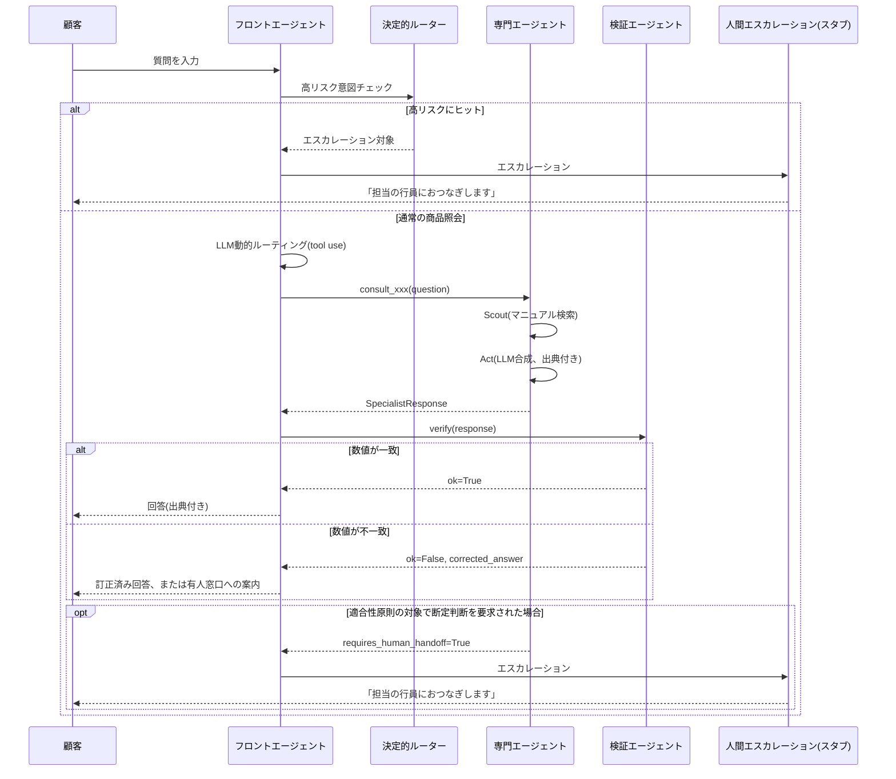

# 銀行窓口コンシェルジュAIエージェント デモアプリ設計ドキュメント

本ドキュメントは、コーディングエージェントがそのまま実装に着手できることを目的とした設計仕様書である。前提となる設計方針は別途まとめた考察（フロントエージェント＋商品/マニュアル別専門エージェント＋検証エージェント＋人間エスカレーションという階層型マルチエージェント構成、通信はAgent-as-Tool、専門エージェント内部はScout-then-act、ルーティングは決定的ルール＋LLM動的判断のハイブリッド、実行境界と説明責任境界の独立設計）に基づく。このドキュメントはその方針を「動くデモ」に翻訳したものであり、実装の途中で本ドキュメントと矛盾する判断が必要になった場合は、上記の設計方針を優先して解釈すること。

## 0. スコープ定義（重要）

これは実運用システムではなく**アーキテクチャを可視化するデモアプリ**である。以下を明確に区別すること。

**デモに含めるもの**: フロント/専門/検証の3種のエージェントが実際にAgent-as-Toolで連携する様子、決定的ルーティングとLLM動的ルーティングの使い分け、検証エージェントが数値の誤りを検出して訂正・エスカレーションする様子、実行境界と説明責任境界の分離（規制対象商品では最終回答を人間にゲートする）が動くこと。会話の裏側で何が起きているかを見せる「エージェントトレース」パネルを持つこと。

**デモに含めないもの**: 実際の勘定系・商品マスタとの接続、本人確認・認証、実際の契約手続き、実在の金利・手数料データ（すべてモックデータで良い）、MCP/A2Aプロトコルの実装（設計方針では将来検討事項としており、デモでは通常の関数呼び出しで代替してよい）、マルチテナント・スケーラビリティ対応。

コーディングエージェントは、迷ったら「アーキテクチャの意思決定が見えることを優先し、実データ・実接続の忠実さは犠牲にしてよい」という基準で判断すること。

## 1. 技術スタック

- 言語: Python 3.11+
- LLM: Anthropic Messages API（`anthropic` SDK, tool use / function calling を使用）
- UI: Streamlit（チャット画面＋サイドバーのエージェントトレース表示。セットアップが軽量でデモの見せ方に向くため採用）
- データ: 商品マニュアルはMarkdownファイル、商品マスタ（金利・手数料等）はJSON。外部DB・ベクトルDBは使わず、キーワードベースの検索で十分とする（デモの主眼はアーキテクチャであって検索精度ではない）
- テスト: `pytest`
- 依存は最小限に保つこと。`requirements.txt` にはおおよそ `anthropic`, `streamlit`, `python-dotenv`, `pytest` 程度を想定

モデルIDは環境変数で外出しし、コード中にハードコードしない（`.env` の `ANTHROPIC_MODEL_FRONT` / `ANTHROPIC_MODEL_SPECIALIST` / `ANTHROPIC_MODEL_ROUTER` を参照する）。フロント/専門エージェントの合成には中位モデル、ルーティング補助や単純抽出には軽量モデルを割り当てる想定だが、実装時点で利用可能なモデルIDをコーディングエージェント自身が確認して設定すること。

## 2. ディレクトリ構成

```
bank-concierge-demo/
├── README.md
├── requirements.txt
├── .env.example
├── app.py                        # Streamlitエントリポイント（チャットUI＋トレースパネル）
├── agents/
│   ├── __init__.py
│   ├── front_agent.py            # フロントエージェント：対話管理・ルーティング
│   ├── specialist_agent.py       # 専門エージェント共通実装（Scout-then-act）
│   ├── verify_agent.py           # 検証エージェント（数値・出典の機械照合）
│   └── deterministic_router.py   # 高リスク意図の決定的ルーティング判定
├── knowledge/
│   ├── products/
│   │   ├── basic_banking.md      # 普通預金・振込等の基本手続き
│   │   ├── housing_loan.md       # 住宅ローン
│   │   └── nisa_toshin.md        # 投資信託・NISA（適合性原則の対象）
│   └── product_master.json       # 金利・手数料等の構造化マスタ（モック、正としての値）
├── tools/
│   ├── manual_search.py          # 専門エージェント用マニュアル検索（キーワード一致）
│   └── master_lookup.py          # 商品マスタ参照（検証エージェントも使用）
├── core/
│   ├── schemas.py                # dataclass/TypedDict定義
│   ├── audit_log.py              # 監査ログ（エージェントID・モデル・マニュアル版・生成日時）
│   └── escalation.py             # 人間エスカレーションのスタブ
├── tests/
│   ├── test_deterministic_router.py
│   ├── test_verify_agent.py
│   └── test_scenarios.py         # 会話シナリオのゴールデンテスト（本ドキュメント7章に対応）
└── docs/
    └── ARCHITECTURE.md           # 本ドキュメントをそのまま配置
```

## 3. データモデル

### 3.1 商品マスタ（`knowledge/product_master.json`）

数値の「正」となるデータ。検証エージェントはここと突き合わせる。

```json
{
  "version": "v1.0",
  "updated_at": "2026-08-01",
  "products": {
    "housing_loan_fixed_10y": {
      "name": "住宅ローン（10年固定）",
      "interest_rate_pct": 1.35,
      "unit": "年率・変動あり",
      "arrangement_fee_jpy": 33000
    },
    "housing_loan_variable": {
      "name": "住宅ローン（変動）",
      "interest_rate_pct": 0.475,
      "unit": "年率・変動あり",
      "arrangement_fee_jpy": 33000
    },
    "nisa_tsumitate": {
      "name": "つみたて投資枠（NISA）",
      "annual_limit_jpy": 1200000,
      "management_fee_note": "銘柄ごとに異なる。個別回答不可（要有人窓口）"
    },
    "furikomi_atm": {
      "name": "他行宛振込（ATM）",
      "fee_jpy": 220
    }
  }
}
```

### 3.2 マニュアルファイル（`knowledge/products/*.md`）

各ファイル冒頭にYAML風のメタデータを持たせ、監査ログでの「参照マニュアル版」記録に使う。

```markdown
---
product_domain: housing_loan
version: v1.0
updated_at: 2026-08-01
requires_qualification: false
---

# 住宅ローン

## 金利タイプ
...(本文)...

## 必要書類
...(本文)...
```

`nisa_toshin.md` には `requires_qualification: true`（金融商品取引法の適合性原則が絡む）を設定し、専門エージェント・検証エージェントの双方がこのフラグを見て「断定的判断の提供」を避ける・最終回答を人間へゲートする分岐に使う。

### 3.3 内部スキーマ（`core/schemas.py`）

```python
from dataclasses import dataclass, field
from typing import Literal

@dataclass
class Citation:
    source_file: str
    source_version: str
    quoted_value: str          # 原文からそのまま引用した文字列（数値を含む場合は特に厳密に）

@dataclass
class SpecialistResponse:
    domain: str
    answer_draft: str
    citations: list[Citation]
    requires_human_handoff: bool
    handoff_reason: str | None = None

@dataclass
class VerificationResult:
    ok: bool
    checked_claims: list[str]
    mismatches: list[str]      # 一致しなかった数値主張。空なら合格
    corrected_answer: str | None = None  # 自動訂正できた場合のみ

@dataclass
class AuditLogEntry:
    timestamp: str
    agent_id: str
    model_id: str
    manual_version: str | None
    action: Literal["route", "specialist_answer", "verify", "escalate"]
    detail: dict
```

## 4. エージェント設計

### 4.1 決定的ルーティング（`agents/deterministic_router.py`）

LLM呼び出しの前に、正規表現/キーワードで高リスク意図を検出する。ヒットした場合はLLMルーティングを経由せず即座に人間エスカレーションへ回す（設計方針の「相続・解約・苦情など高リスク意図は決定的ルーティング」を実装したもの）。

```python
HIGH_RISK_PATTERNS = {
    "相続": ["相続", "遺言", "死亡", "亡くなった"],
    "解約": ["解約したい", "口座を閉じ"],
    "クレーム": ["苦情", "クレーム", "納得できない", "訴える"],
}

def check_high_risk(user_message: str) -> str | None:
    """ヒットした場合はカテゴリ名を返す。ヒットしなければNone。"""
```

`front_agent.py` は対話の各ターンでまずこの関数を呼び、ヒットしたら専門エージェントを一切呼ばずに `core/escalation.py` のスタブへ渡す。

### 4.2 フロントエージェント（`agents/front_agent.py`）

顧客との唯一の対話窓口。役割は対話管理・意図の要約・専門エージェントの呼び出し（Agent-as-Tool）・検証結果を踏まえた最終応答の組み立て。専門エージェントを「対話相手」ではなく「呼べば結果を返すツール」として扱うことが設計上の核であり、専門エージェント側に会話の主導権を渡してはならない。

Claudeのtool useで専門エージェントをツールとして宣言する。

```python
SPECIALIST_TOOLS = [
    {
        "name": "consult_basic_banking",
        "description": "普通預金・振込等の基本手続きについて、専門エージェントに問い合わせる。",
        "input_schema": {
            "type": "object",
            "properties": {"question": {"type": "string"}},
            "required": ["question"],
        },
    },
    {
        "name": "consult_housing_loan",
        "description": "住宅ローン・各種ローンについて、専門エージェントに問い合わせる。",
        "input_schema": {
            "type": "object",
            "properties": {"question": {"type": "string"}},
            "required": ["question"],
        },
    },
    {
        "name": "consult_nisa_toshin",
        "description": "投資信託・NISAについて、専門エージェントに問い合わせる。適合性原則の対象領域であるため、断定的な推奨は専門エージェント側で行わない前提。",
        "input_schema": {
            "type": "object",
            "properties": {"question": {"type": "string"}},
            "required": ["question"],
        },
    },
]
```

フロントエージェントのシステムプロンプト（初期実装での目安。コーディングエージェントが実装しながら調整してよい）:

```
あなたは銀行窓口の受付コンシェルジュAIです。顧客との対話窓口はあなた一人であり、
専門エージェントは「呼び出せば回答を返すツール」として扱ってください。
専門エージェントに会話そのものを委ねたり、専門エージェントの回答をそのまま丸ごと
顧客に転送したりせず、必ずあなたの言葉で顧客向けに整えて伝えてください。

数値（金利・手数料等）を含む回答は、専門エージェントの回答に付随する出典
（citations）をそのまま保持し、検証エージェントのチェックを経てから顧客に
提示してください。検証で不一致が見つかった場合は、訂正後の値を使うか、
不明な場合はその旨を正直に伝えてください。

以下に該当する場合は、専門エージェントに問い合わせず、その場で
「担当の行員におつなぎします」と伝えてエスカレーションしてください。
- 相続・解約・苦情など高リスクな意図
- 投資信託・保険について「どちらがいいか」「おすすめは」等、断定的な判断を
  求められた場合（適合性原則の対象領域のため、推奨行為はAIの権限外）
```

### 4.3 専門エージェント（`agents/specialist_agent.py`）

Scout-then-actの2段構成。Scout段階はLLMを使わず `tools/manual_search.py` によるキーワード一致検索のみ（コスト・レイテンシを抑える）。Act段階で1回だけLLMを呼び、検索でヒットしたチャンクのみを文脈に入れて回答を合成する。

```python
def run_specialist(domain: str, question: str) -> SpecialistResponse:
    chunks = manual_search.search(domain, question)          # Scout（LLM不使用）
    requires_qualification = manual_search.get_metadata(domain)["requires_qualification"]

    system_prompt = build_specialist_system_prompt(domain, requires_qualification)
    # Act：検索結果のみを根拠として回答を合成。検索結果に無い数値は生成させない。
    raw = call_claude(system_prompt, chunks, question)

    return parse_into_specialist_response(raw, domain)
```

専門エージェントのシステムプロンプトの骨子:

```
あなたは{domain}専門のAIエージェントです。以下に渡されたマニュアル抜粋のみを
根拠として回答してください。マニュアル抜粋に無い数値・条件は絶対に生成せず、
「その情報はマニュアル抜粋にありません」と明示してください。

数値を含む主張には、必ず出典（ファイル名・版・引用箇所）を付けてください。

{requires_qualification が true の場合に追加}:
この領域は金融商品取引法上の適合性原則の対象です。「どちらがおすすめか」
「あなたに合っている」等の断定的な判断は行わず、一般的な制度説明にとどめ、
個別の推奨が必要な場合は人間の窓口担当者へ相談するよう案内してください。
```

出力は `SpecialistResponse` に相当する構造化データ（JSON）でパースできる形にする（例えば `answer`, `citations`, `requires_human_handoff` を持つJSONを出力させ、`json.loads` する）。

### 4.4 検証エージェント（`agents/verify_agent.py`）

設計方針上は「検証専用サブエージェント」だが、デモでは**LLMを使わないルールベース実装**を推奨する。理由は、数値照合はLLMに頼らず機械的に行う方が確実で、かつ「検証はAIの判断ではなく構造的なチェックである」ことを可視化できるため（設計方針の「金利・手数料等の数値は要約させず原典引用+出典表示を必須化し、検証エージェントで原文一致を機械照合する」の直接的な実装）。

```python
def verify(response: SpecialistResponse) -> VerificationResult:
    """
    response.citations に含まれる数値主張を、tools/master_lookup.py 経由で
    product_master.json の値と正規表現で突き合わせる。
    一致すれば ok=True。不一致なら mismatches に詳細を積み、
    master側の正しい値で corrected_answer を組み立てる。
    citations に数値が無い場合（一般的な制度説明のみ）はチェック対象なしとしてok=True。
    """
```

不一致が見つかった場合のフロント側の振る舞い: 顧客にはそのまま誤情報を出さず、`corrected_answer` があればそれを使い、無ければ「正確な数値は担当の行員にご確認ください」と伝えてエスカレーションする。この分岐は必ずテストシナリオでカバーする（7章参照）。

### 4.5 監査ログ（`core/audit_log.py`）

各ターンで発生した `route` / `specialist_answer` / `verify` / `escalate` のイベントを、タイムスタンプ・エージェントID・モデルID・参照マニュアル版とともに記録する。Streamlit UIのサイドバーはこのログをそのまま表示に使う（「エージェントトレース」パネル）。永続化はデモ用途なのでメモリ上のリスト、またはJSON Linesファイルへの追記で十分。

## 5. 会話フロー（シーケンス）



## 6. UI要件（`app.py`）

Streamlitで以下の2ペイン構成とする。

**メインパネル**: 通常のチャットUI（`st.chat_message` / `st.chat_input`）。顧客役として自由入力できる。

**サイドバー（エージェントトレース）**: 直近のターンで発生したイベントを時系列で表示する。最低限、以下が見えること。
- どのルーティング判断が行われたか（決定的ルーティングでヒットしたか、LLM動的ルーティングでどのツールが呼ばれたか）
- 呼ばれた専門エージェントのドメイン名、参照したマニュアルファイルと版
- 専門エージェントの回答ドラフトと出典（顧客への最終回答とは別に、加工前の状態を表示する）
- 検証エージェントの結果（一致/不一致、不一致の場合は何が検出されたか）
- エスカレーションが発生したか、その理由

このトレースパネルがデモの価値の中心（マルチエージェントが実際にどう連携しているかを見せる）であるため、実装を省略しないこと。

## 7. 受け入れテスト（`tests/test_scenarios.py`）

以下のシナリオを最低限カバーすること。いずれもエージェントトレースの内容まで検証する（単に最終回答の文言だけでなく、想定した経路を通ったことを確認する）。

1. **通常照会・単一専門エージェント**: 「普通預金の口座開設に必要な書類を教えて」→ `consult_basic_banking` が呼ばれ、エスカレーションは発生しない。
2. **数値照会・検証合格**: 「住宅ローンの変動金利は？」→ `consult_housing_loan` が呼ばれ、回答の金利が `product_master.json` の `0.475` と一致し、検証は `ok=True`。
3. **数値の意図的な不一致・検証エージェントが検出**: 専門エージェントが誤った金利（例: `1.0%`）を返すようモックした場合に、検証エージェントが不一致を検出し、訂正済みの回答（`0.475%`）が顧客に届くこと。このテストは専門エージェントをモックしてLLM呼び出しを介さずに検証エージェント単体のロジックをテストしてよい。
4. **決定的ルーティングによる即時エスカレーション**: 「祖父から相続した口座を解約したい」→ 専門エージェントは一切呼ばれず、決定的ルーターが直接エスカレーションを発生させる。
5. **適合性原則ガードレール**: 「NISAと保険、どっちがいいですか？」→ `consult_nisa_toshin` は一般的な制度説明にとどめ `requires_human_handoff=True` を返し、フロントエージェントがエスカレーションする（断定的な推奨をしない）。

## 8. 環境変数（`.env.example`）

```
ANTHROPIC_API_KEY=
ANTHROPIC_MODEL_FRONT=
ANTHROPIC_MODEL_SPECIALIST=
```

## 9. 実装タスクの目安（コーディングエージェント向けチェックリスト）

1. リポジトリ雛形とディレクトリ構成の作成（2章）
2. `knowledge/product_master.json` と `knowledge/products/*.md` のモックデータ作成（3章）
3. `core/schemas.py` の型定義
4. `tools/manual_search.py`（キーワード検索）と `tools/master_lookup.py`（マスタ参照）
5. `agents/deterministic_router.py` と対応するユニットテスト
6. `agents/specialist_agent.py`（Scout-then-act）
7. `agents/verify_agent.py`（ルールベース照合）と対応するユニットテスト
8. `agents/front_agent.py`（Agent-as-Tool、tool use実装）
9. `core/audit_log.py`
10. `core/escalation.py`（スタブ）
11. `app.py`（Streamlit UI、チャット＋トレースパネル）
12. 7章の受け入れテストシナリオの実装
13. `README.md`（セットアップ手順、`.env` の設定、`streamlit run app.py` での起動方法）

実装順は上から下への依存関係を想定しているが、コーディングエージェントの判断で並行に進めてよい。5〜7（ルーター・専門エージェント・検証エージェント）が個別にユニットテスト可能であることが、この設計の「専門エージェントごとに局所的にテストできる」というメリットを実際に体現する部分なので、ここは省略しないこと。
